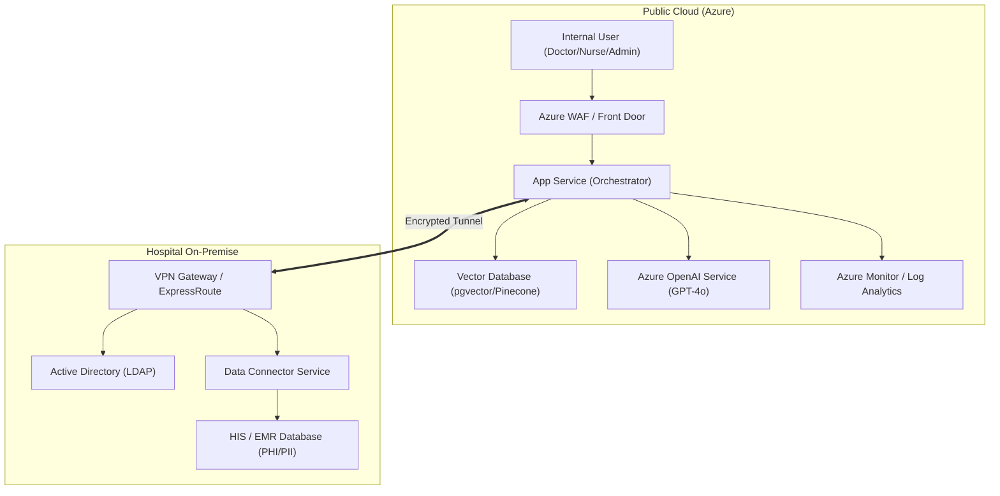

# Target Architecture

This document describes the high-level system architecture for the **Hospital Clinical Support Assistant**.

## 1. System Overview

The system follows a **Hybrid Cloud** architecture, separating the sensitive data management from the high-performance AI computation.

## 2. Architecture Diagram

## 3. Key Components

### 3.1 AI Orchestrator (Cloud)
*   **Role:** Handles user requests, manages the chat workflow, and coordinates between the Vector DB and LLM.
*   **Technology:** Python (FastAPI) or Node.js, deployed on Azure App Service.

### 3.2 RAG Engine (Cloud)
*   **Vector Database:** Stores embeddings of SOPs, internal guidelines, and anonymized knowledge.
*   **Embedding Model:** text-embedding-3-small for cost efficiency.

### 3.3 Data Connector (On-Premise)
*   **Role:** Securely fetches relevant medical record fragments based on the user's role and patient ID.
*   **Security:** Only the specific context needed for the prompt is retrieved. No bulk data export.

### 3.4 Connectivity
*   **VPN/ExpressRoute:** A dedicated, encrypted private tunnel between the Hospital Data Center and Azure VNet.
*   **Encryption:** TLS 1.3 for all data in transit. AES-256 for all data at rest.

## 4. Scaling Strategy
*   **Horizontal Scaling:** App Service replicas increase based on CPU/RAM usage.
*   **LLM Throttling:** Implementation of a token bucket rate limiter to prevent hitting provider limits.
*   **Vector DB Partitioning:** Indexing by hospital department to improve search speed as data grows.
